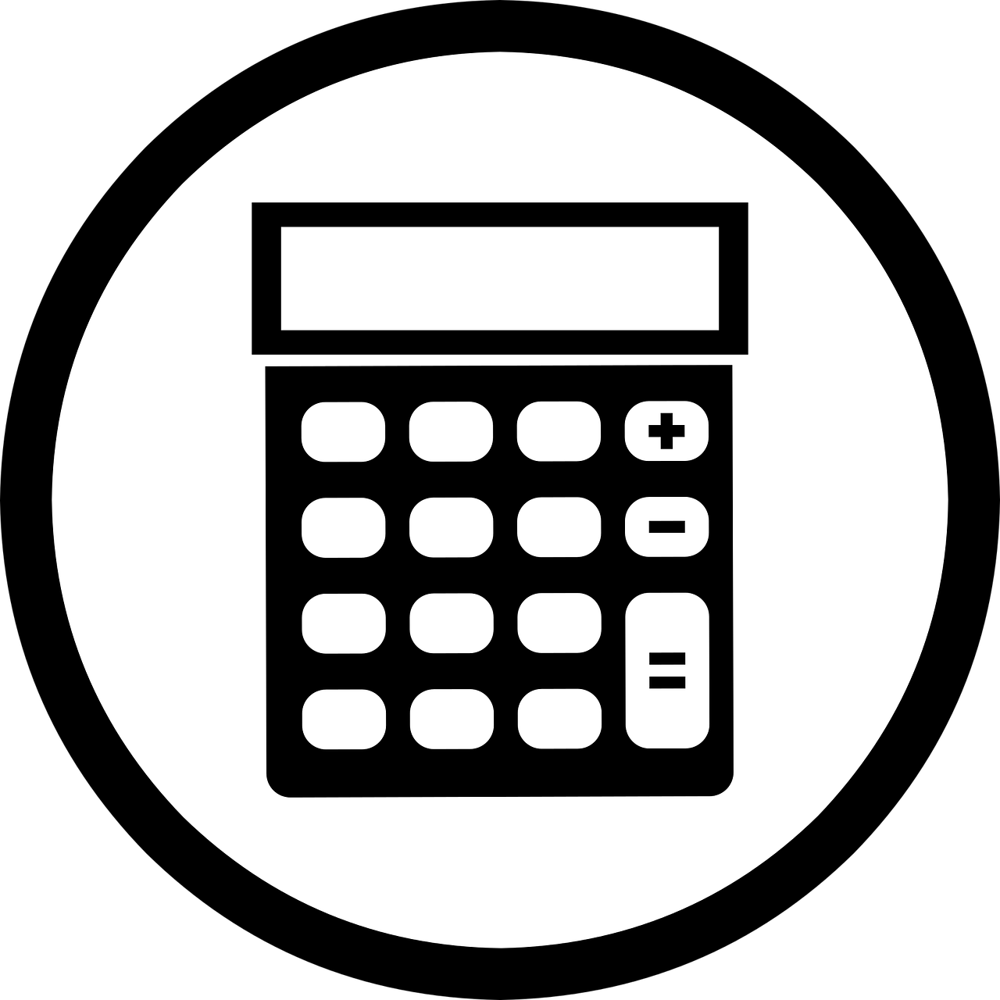
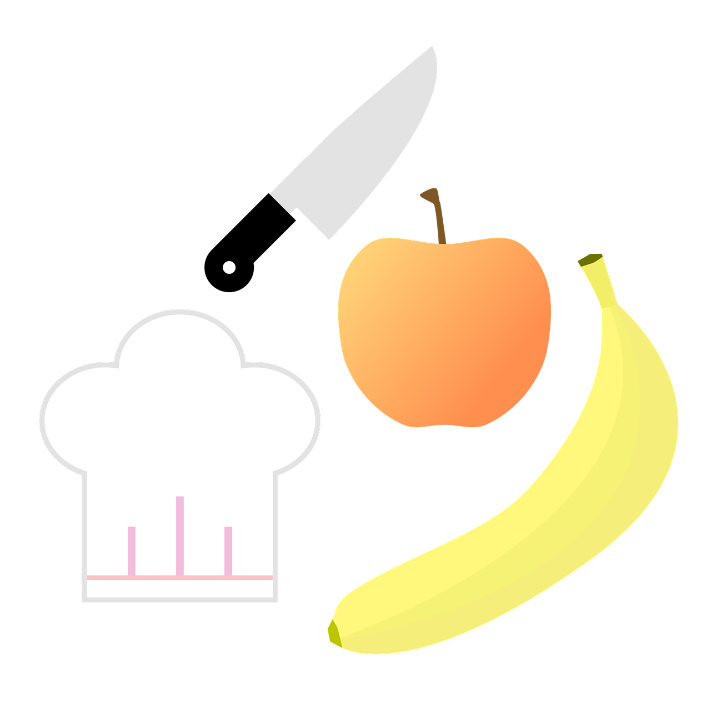

# Project-landing-page
I'll be creating a landing page to showcase, my foundational HTML and CSS skills

This is a simple landing page i use to showcase the projects i've completed from the odin project 
foundation course. And to be fair i've only done two which is this and the recipe page.

The main objective from completing this course is to validate the skils picked up from the flexbox 
section, as flexbox was used as the primary layout mode for the most intricate parts of the page.

<!-- Refrence image creators? -->

Image by [Mohamed Hassan @ Pixabay](https://pixabay.com/users/mohamed_hassan-5229782/)

Image by [Janjf93 @ Pixabay](https://pixabay.com/users/janjf93-3084263/)

Image by [OpenClipart-Vectors @ Pixabay](https://pixabay.com/users/openclipart-vectors-30363/)

Image by [GDJ @ Piabay](https://pixabay.com/users/gdj-1086657/)